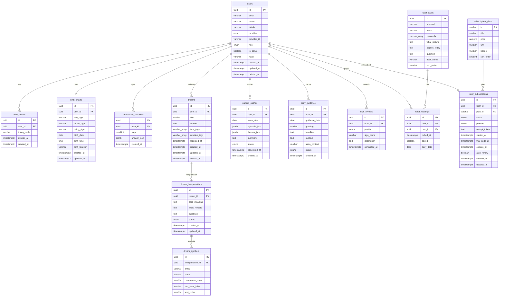

# Lumen Database Schema

ER diagram for all tables defined in `src/database/migrations/1700000000000-InitialSchema.ts`. Relationships reflect foreign keys + uniqueness constraints.

## Relationship key

| Mermaid   | Meaning                                  |
| --------- | ---------------------------------------- |
| `\|\|--o{` | exactly one on the left → zero-or-many   |
| `\|\|--o\|` | exactly one on the left → zero-or-one    |

## Schema notes (not visible in the diagram)

- **Enums:**
  - `users.provider`: `email`, `google`, `apple`
  - `users.role`: `user`, `admin`
  - `dream_interpretations.status` / `pattern_caches.status` / `daily_guidance.status`: `pending`, `processing`, `done`, `failed` (processing only on dream_interpretations)
  - `sign_reveals.position`: `sun`, `moon`, `rising`
  - `user_subscriptions.status`: `trial`, `active`, `cancelled`, `expired`
  - `user_subscriptions.provider`: `apple`, `google`, `stripe`

- **Soft deletes:** `users` and `dreams` use `deleted_at`. Queries exclude rows where it's non-null.

- **Unique constraints:**
  - `users.email` — unique only among non-deleted rows (partial unique index)
  - `birth_charts.user_id`, `user_subscriptions.user_id` — one per user
  - `onboarding_answers(user_id, step)` — one answer per user per step
  - `dream_interpretations.dream_id` — one per dream
  - `pattern_caches(user_id, week_start)` — one per user per week
  - `daily_guidance(user_id, guidance_date)` — one per user per day
  - `sign_reveals(user_id, position)` — one per user per position
  - `tarot_readings(user_id, daily_date)` — unique only when `daily_date IS NOT NULL` (non-daily pulls can repeat)
  - `tarot_cards.sort_order` — 0–21, unique

- **Cascade:** every `user_id` FK is `ON DELETE CASCADE`. `dream_interpretations` cascades to `dream_symbols`; `dreams` cascades to its interpretation.

- **Full-text search:** GIN index on `dreams` over `to_tsvector('english', coalesce(title,'') || ' ' || content)`.

- **CHECK constraints on `dreams`:**
  - `type_tags ⊆ {Nightmare, Recurring, Lucid, Vivid, Fragment}`
  - `emotion_tags ⊆ {Peaceful, Anxious, Confused, Inspired, Heavy}`

- **Reference tables:** `tarot_cards` (22 rows) and `subscription_plans` (3 rows) are seeded via `npm run seed:run:relational` and are read-only at runtime.
